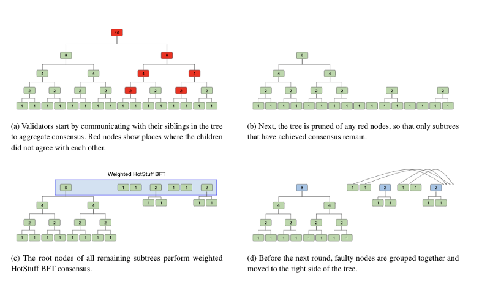

# BFTree

> \(BFtreee\) ... enable a more decentralized proof-of-stake protocol by eliminating the need for two classes of nodes and delegation to a small number of validators. We view the goal of scaling to millions of validators as a forcing function to create a more scalable consensus  
> algorithm where BFT is no longer the bottleneck in terms of  
> making cryptocurrencies more decentralized. In practice, other bottlenecks, such as block sizes, may make the ideal number of validators be tens or hundreds of thousands of nodes for large cryptocurrencies.
>
> BFTree arranges validators into a virtual tree, to parallelize signature aggregation between non-byzantine nodes working to achieve consensus. When byzantine nodes interfere with the aggregation, the roots of all subtrees that were able to achieve agreement perform BFT consensus to finish the round, frequently with fewer messages than if all validators participated. By thoughtfully reorganizing the tree such that nodes that have historically been reliable are paired with other reliable nodes, BFTree limits the impact that a byzantine node can have. Source: [https://medium.com/celohq/bftree-scaling-hotstuff-to-millions-of-validators-7d6930ee046a](https://medium.com/celohq/bftree-scaling-hotstuff-to-millions-of-validators-7d6930ee046a)

### Whitepaper

* [CELO Whitepaper](https://storage.googleapis.com/celo_whitepapers/BFTree%20-%20Scaling%20HotStuff%20to%20Millions%20of%20Validators.pdf)

### Used in 

* [Celo](https://celo.org/)

