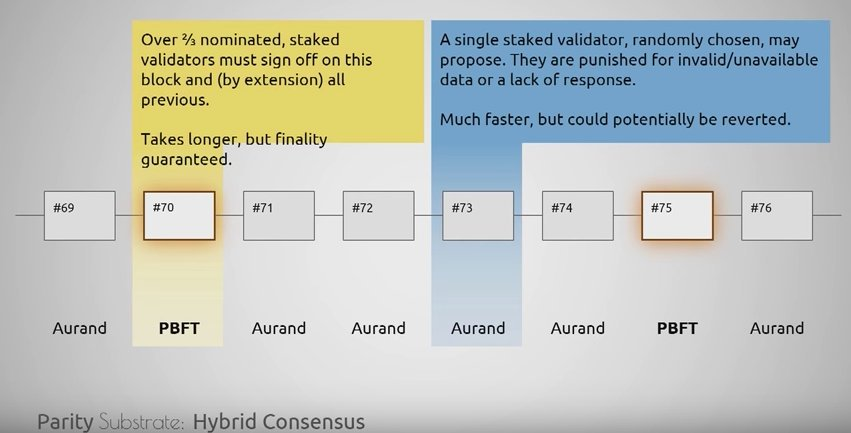

# Hybrid PBFT/Aurand

Polkadot uses a hybrid PBFT / Aurand consensus mechanism that has two degrees of finality. This consensus mechanism allows for relatively low latency state transitions while mitigating certain attacks to the network.

The PBFT derivative provides absolute finality. Aurand, a derivative of Aura, provides fast, simple, and intermediate finality. Every so many blocks there is a PBFT check-point that guarantees finality, while the Aurand sets up the intermediary states of finality.

With Aurand one randomly chosen validator may propose a block, which \*may be reverted\* \(faster\). They are punished \(slashed\) for proposing invalid blocks or for going offline. With PBFT &gt; 2/3 of staked validators must sign-off to \*guarantee finality\* \(slower\).

PBFT finality happens every ~30 seconds while Aurand blocks are proposed every ~4-5 seconds, potentially faster.

POC-4 will introudce Aura v2, a progressive-consensus with milestone finalisation \([https://github.com/paritytech/polkadot/milestone/4 …](https://t.co/vX5a2Z0lL5)\). [@**web3foundation**](https://twitter.com/web3foundation) researcher Alistair Stewart is working on this alongside Polkadot core devs [@**gavofyork**](https://twitter.com/gavofyork) and [@**rphmeier**](https://twitter.com/rphmeier).

Become an expert on Polkadot's consensus mechanism \(through POC-3\) by watching [@**gavofyork**](https://twitter.com/gavofyork) present [@**ParityTech**](https://twitter.com/ParityTech)'s [\#**Substrate**](https://twitter.com/hashtag/Substrate?src=hash) at Event Horizon, starting at minute 17:30.

### used in

* Polkadot



source [https://twitter.com/polkadotnetwork/status/1012743882436763648](https://twitter.com/polkadotnetwork/status/1012743882436763648)

