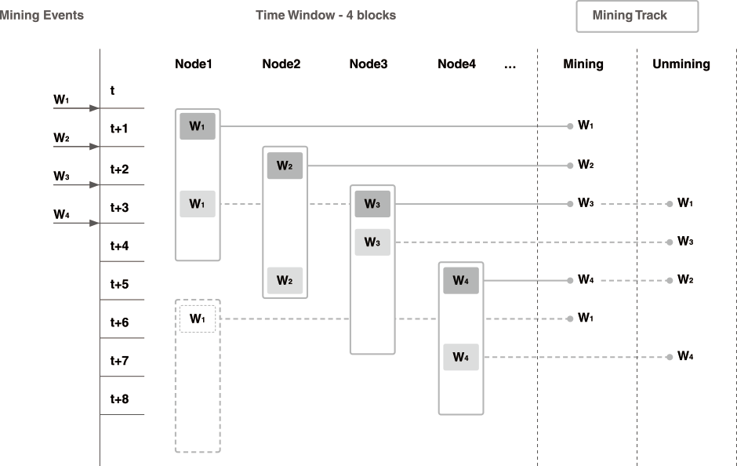
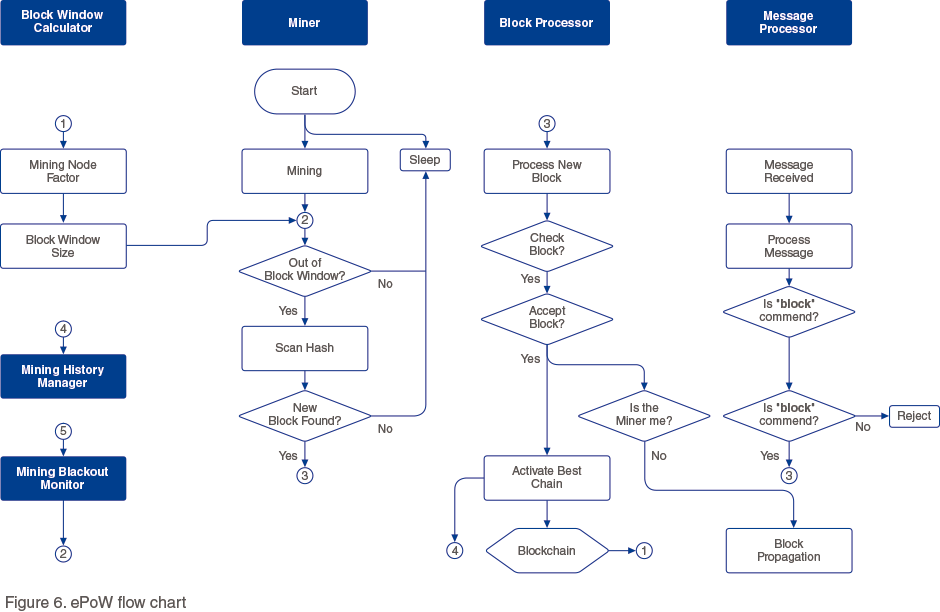

# ePoW: equitable chance and energy-saving.

Hdac uses ePoW as a consensus algorithm for creating new blocks and connecting them to the blockchain. ePoW refers to “PoW based on equitable chance and energy-saving.” The Hdac algorithm considers these two as its basic philosophy.

The ePoW consensus algorithm can reduce the number of nodes participating in PoW and motivates the participation of multiple mining nodes. As a result, we intend to prevent energy waste due to excessive hashing power for mining competition and distribute equitable mining opportunities.  

Hdac ePoW is a consensus algorithm that reduces the mining monopoly by applying the block window concept. It reduces the wasteful energy consumed in the hash calculation by avoiding spontaneous mining attempts during the block window application period once the mining is successful. If a node succeeds in mining, no new block can be mined during the block window application period. Even if a greedy node neglects this mechanism and succeeds in mining a new block, it will not be recognized as a valid block in the entire Hdac blockchain network, thus eliminating the need to try to find an invalid block.

The block hash must satisfy the data specification according to the degree of difficulty and should not be within a given block window \(time spacing\). This block window size can be expressed in the form of a time function, Ws = f\(t\). “F\(t\)” is a function that increases in proportion to time, and therefore the window size gradually increases with time. This means that there is a great opportunity for early participants, and over time, it becomes increasingly difficult for certain mining nodes to monopolize mining and more equitable distribution can be achieved.

The ePoW block window is a system that gives certain constraints on mining attempts after succeeding in mining in a certain PoW cycle. The block window size \(Ws\) is defined as, f\(t\) = \[\(N\*0.7\) x \(cumulative number of blocks currently \(t\)\)\] / \(cumulative block number for 10 years \(tm\)\), and the node factor \(N\) is calculated from the list of recent successful mining nodes. The reason for the arrival time of the maximum block window size \(Wm\) being 10 years is because it is set to reach the point of more than 80% of the total block generation by that time.

### Pros

* Reduce the number of nodes participating in PoW, 
* Motivates the participation of multiple mining nodes which get equitable mining opportunities,

### Used in 

* HDAC [https://www.hdactech.com](https://www.hdactech.com)
* HDAC WhitePaper [https://github.com/Hdactech/doc/wiki/Whitepaper\#consensus-algorithm](https://github.com/Hdactech/doc/wiki/Whitepaper#consensus-algorithm)

