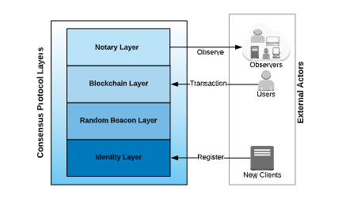

# ThresholdRelay

DFINITY consensus mechanism is a heavily optimized [proof of stake](https://blockonomi.com/proof-of-stake-coins/) \(PoS\) model. It places a strong emphasis on transaction finality through implementing a Threshold Relay technique in conjunction with the BLS signature scheme and a notarization method to address many of the problems associated with PoS consensus.

> “The Threshold Relay is the mechanism by which Dfinity randomly samples replicas into groups, sets the groups \(committees\) up for threshold operation, chooses the current committee, and relays from one committee to the next is called the threshold relay.”

### How it works

1. The Identity Layer provides the registry for all the clients. Open registration is possible through a stake deposit with a lock-up period.
2. The Random Beacon Layer provides the source of randomness for all higher layers using a Verifiable Random Function \(VRF\).
3. The Blockchain Layer is driven by the randomness of the Random Beacon Layer and builds a blockchain from the verified transactions.
4. The Notary Layer provides fast finality guarantees to clients in the network.

### Pros

* 

### Cons

* 
### Used in 

* Dfinity [https://dfinity.org](https://dfinity.org/tech)
* Dfinity Whitepaper [https://dfinity.org/tech](https://dfinity.org/tech)
* Dfinity in 2 minutes [https://www.youtube.com/watch?v=kyCfGRZaDnw](https://www.youtube.com/watch?v=kyCfGRZaDnw)

